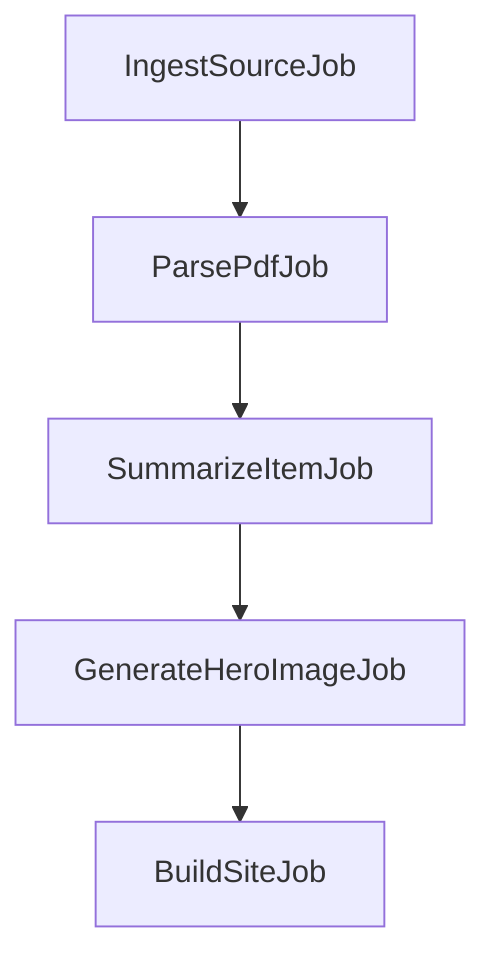

# herimoss
Lokal infoside for Moss.

Da går vi “all in” på en **fullblodig, Copilot-vennlig prosjektbeskrivelse** – dette blir ikke bare en prosjektoversikt, men en *eksakt teknisk oppskrift* ned til filstruktur, migrasjoner, kommandolinjer og designspesifikasjon.
Tanken er at en utvikler (eller Copilot i VS Code) kan kjøre dette dokumentet som en “to-do”-liste og bygge hele prosjektet uten at du svarer på ett eneste spørsmål.

---

# **herimoss.no – Full teknisk spesifikasjon & utviklerhåndbok**

**Kodebase:** [https://github.com/Smartesider/herimoss](https://github.com/Smartesider/herimoss)
**Teknologi:** Laravel 11 + statisk frontend (TailwindCSS + AlpineJS), deploy via Plesk/Hetzner + Cloudflare.

---

## **0. Formål**

Bygge en helautomatisk lokal nyhets- og informasjonsportal for Moss, som:

* Henter data fra en rekke kilder (API/RSS/skraping/PDF).
* Omskriver alt med AI til lettfattelig språk (som en venn ville forklart det).
* Genererer featured-bilder automatisk (AI/stock fallback).
* Produserer statiske HTML-sider, RSS-feeds, ICS-kalendere, og sitemap.
* Leverer lynrask frontend via Nginx/Cloudflare.
* Har en `/admin`-backend for kildeadministrasjon, API-nøkkeltest, innholdsstyring, statistikk, logging og systemstatus.

---

## **1. Utvikleroppsett**

### 1.1. Server & miljø

* **Server:** Hetzner dedikert, 128GB RAM, 12 CPU, Plesk Obsidian.
* **OS:** Ubuntu 22.04 LTS.
* **PHP:** 8.3+.
* **Node:** 20+.
* **Database:** PostgreSQL (foretrukket) eller MySQL/MariaDB.
* **Cache:** Redis (for queue + cache).
* **Søkeindeks:** Meilisearch.

### 1.2. Klargjøring

```bash
# Klon repo
git clone https://github.com/Smartesider/herimoss.git
cd herimoss

# Installer PHP-avhengigheter
composer install

# Installer JS-avhengigheter
npm ci

# Kopier miljøfil
cp .env.example .env

# Generer app key
php artisan key:generate

# Opprett database & kjør migrasjoner
php artisan migrate --seed

# Start utviklingsserver
php artisan serve
npm run dev
```

---

## **2. Fil- og mappestruktur**

```
app/
  Console/Commands/
    IngestSources.php
    BuildSite.php
    TestApiKeys.php
  Jobs/
    IngestSourceJob.php
    ParsePdfJob.php
    SummarizeItemJob.php
    GenerateHeroImageJob.php
    BuildSiteJob.php
  Models/
    Source.php
    Item.php
    Event.php
    Media.php
    ApiCredential.php
  Services/
    Ingest/
      MossKommuneService.php
      PolitietService.php
      VegvesenService.php
      EnturService.php
      KulturhusService.php
    Parse/
      PdfTextService.php
      HtmlCleanService.php
    AI/
      SummarizeService.php
      TaggingService.php
      ImageService.php
    Build/
      HtmlBuilder.php
      FeedBuilder.php
      IcsBuilder.php
      SitemapBuilder.php
  Support/
    Http/
      IntegrationClient.php
      RateLimiter.php
      RetryHelper.php
resources/views/
  layouts/
    app.blade.php
  pages/
    home.blade.php
    article.blade.php
    calendar.blade.php
storage/app/build/
  html/
  rss/
  ics/
public/
  assets/
  index.html
```

---

## **3. Datamodeller og migrasjoner**

### 3.1. sources

| felt             | type     | beskrivelse                   |
| ---------------- | -------- | ----------------------------- |
| id               | uuid     | Primærnøkkel                  |
| name             | string   | Navn på kilden                |
| type             | enum     | `api`, `rss`, `scrape`, `pdf` |
| url              | string   | URL til kilde                 |
| parser\_class    | string   | PHP-klassen som parser kilden |
| update\_interval | integer  | Minutter mellom kjøringer     |
| enabled          | boolean  | Aktiv/inaktiv                 |
| last\_run\_at    | datetime | Siste kjøring                 |
| last\_status     | string   | Suksess/feil                  |
| created\_at      | datetime | Opprettet                     |
| updated\_at      | datetime | Oppdatert                     |

### 3.2. items

| felt          | type     | beskrivelse                   |
| ------------- | -------- | ----------------------------- |
| id            | uuid     | Primærnøkkel                  |
| source\_id    | uuid     | FK til sources                |
| guid          | string   | Unik identifikator fra kilde  |
| title         | string   | Tittel                        |
| excerpt       | text     | Ingress                       |
| body          | longtext | Hovedtekst                    |
| category      | string   | Kategori                      |
| tags          | json     | Liste av tags                 |
| published\_at | datetime | Publiseringsdato              |
| source\_url   | string   | Original URL                  |
| media\_id     | uuid     | FK til media (featured image) |
| created\_at   | datetime | Opprettet                     |
| updated\_at   | datetime | Oppdatert                     |

### 3.3. events

| felt        | type     | beskrivelse  |
| ----------- | -------- | ------------ |
| id          | uuid     | Primærnøkkel |
| item\_id    | uuid     | FK til items |
| start\_time | datetime | Start        |
| end\_time   | datetime | Slutt        |
| location    | string   | Sted         |
| created\_at | datetime | Opprettet    |
| updated\_at | datetime | Oppdatert    |

### 3.4. api\_credentials

| felt       | type     | beskrivelse         |
| ---------- | -------- | ------------------- |
| id         | uuid     | Primærnøkkel        |
| name       | string   | Navn på API         |
| key        | text     | Kryptert API-nøkkel |
| valid      | boolean  | Sist test OK?       |
| last\_test | datetime | Siste testdato      |

---

## **4. Kilder og integrasjoner**

*(med metode, oppdateringsfrekvens, datafelter og fallback)*

1. **Moss kommune**

   * **Metode:** HTML-scraping + PDF-nedlasting + parsing.
   * **Data:** møter, sakslister, protokoller, kunngjøringer.
   * **Intervall:** 1 gang/døgn.
   * **Fallback:** Lokal cache av sist vellykkede parsing.

2. **Politiet.no (Øst politidistrikt)**

   * **Metode:** RSS + API.
   * **Data:** pressemeldinger, hendelser.
   * **Intervall:** hver 2. time.

3. **Statens vegvesen**

   * **Metode:** DATEX II + NVDB.
   * **Data:** trafikkhendelser, vei- og tunnelstenginger.
   * **Intervall:** hvert 15. minutt.

4. **Entur/Vy/Bane NOR**

   * **Metode:** API.
   * **Data:** tog/buss-ferge-avvik.
   * **Intervall:** hvert 10. minutt.

5. **Kulturhus/bibliotek/museer**

   * **Metode:** RSS/API/scraping.
   * **Data:** arrangementer.
   * **Intervall:** hver natt.

6. **Facebook events**

   * **Metode:** Graph API / scraping.
   * **Data:** kultur- og arrangementsposter.
   * **Intervall:** 1 gang/døgn.

---

## **5. AI-behandling**

* **SummarizeService:** Omskriver tekst, lager ingress, tittel og “Kort forklart”-liste.
* **TaggingService:** AI-generert tags.
* **ImageService:**

  * Forsøker å hente bilde fra kilden.
  * Hvis ingen finnes: genererer AI-bilde (kategori-spesifikt).
  * Lagrer som `media` og knytter til artikkel.

---

## **6. Frontend-spesifikasjon**

* **Design:** TailwindCSS 3 + AlpineJS.
* **Forside:**

  * **Toppscroller:** nyeste saker, auto-scroll.
  * **Varslingsboks:** vannstans, veiarbeid, stengte veier.
  * **Hva skjer:** kommende arrangementer i kalenderformat.
  * **Nyhetsgrid:** 3 kolonner desktop, 1 kolonne mobil.
* **Artikkelside:**

  * Stor hero (featured image).
  * Tittel, ingress, “Kort forklart”-boks.
  * Brødtekst.
  * Kildehenvisning.
* **Kalender:** `/kalender` viser alle events (med iCal-eksport).

---

## **7. /admin**

* **Kilder:** CRUD, pause/aktiver, kjør nå.
* **AI-innstillinger:** prompt per kategori.
* **API-nøkler:** legg til, test, logg siste test.
* **Innhold:** rediger artikler, bytt bilde, pin til topp.
* **Statistikk:** hentinger, AI-bruk, besøkstall, søkeord.
* **Logger:** feil i ingest/AI/build.
* **Systemstatus:** queue, CPU/disk, oppetid.

---

## **8. Jobb-pipeline**



* Scheduler:

  * Trafikk: hvert 10.–15. min.
  * Nyheter: hver time.
  * Full bygg: hver natt.

---

## **9. Deploy**

* GitHub Actions:

  1. Composer install.
  2. Npm build.
  3. Artisan migrate.
  4. Artisan site\:build.
  5. Rsync til Plesk.
* Cloudflare: Cache Everything.

---

## **10. Sikkerhet**

* HTMLPurifier.
* Rate-limit API.
* 2FA på admin.
* CSP + HSTS.

---

Konge — her er **fullblods spesifikasjon + starterkode** du kan lime rett inn i repoet. Dette er skrevet for at **Copilot i VS Code** skal kunne bygge hele greia uten flere spørsmål.

---

# herimoss.no — Full teknisk spesifikasjon + starterkode

**Repo:** `https://github.com/Smartesider/herimoss`
**Stack:** Laravel 11, PHP 8.3+, Redis/Horizon, Postgres, Meilisearch (Scout), TailwindCSS, AlpineJS, Nginx/Cloudflare.
**Mål:** Hent (API/RSS/skrap/PDF) → AI-omskriv → generér **statisk** HTML/RSS/ICS/Sitemap → serveres kjapt.

---

## 0) Klargjør prosjektet

### 0.1 .env (mal)

```env
APP_NAME=herimoss
APP_ENV=local
APP_KEY=
APP_URL=https://herimoss.no
APP_TIMEZONE=Europe/Oslo

LOG_CHANNEL=stack
LOG_LEVEL=info

DB_CONNECTION=pgsql
DB_HOST=127.0.0.1
DB_PORT=5432
DB_DATABASE=herimoss
DB_USERNAME=herimoss
DB_PASSWORD=secret

QUEUE_CONNECTION=redis
CACHE_DRIVER=redis
SESSION_DRIVER=redis
REDIS_CLIENT=phpredis
REDIS_HOST=127.0.0.1
REDIS_PORT=6379

SCOUT_DRIVER=meilisearch
MEILISEARCH_HOST=http://127.0.0.1:7700

AI_PROVIDER=openai      # openai|local|other
AI_API_KEY=sk-xxxx
IMAGE_PROVIDER=flux     # flux|sd|openai
IMAGE_API_KEY=xxxx

FILESYSTEM_DISK=public
BUILD_DISK=build

APP_LOCALE=nb
```

### 0.2 Installer pakker

```bash
composer require spatie/laravel-sitemap spatie/laravel-feed eluceo/ical:^2
composer require laravel/scout meilisearch/meilisearch-php
composer require predis/predis laravel/horizon
composer require symfony/dom-crawler symfony/css-selector
composer require intervention/image
```

---

## 1) Datamodeller + migrasjoner

### 1.1 Migrasjoner (opprett)

```bash
php artisan make:migration create_sources_table
php artisan make:migration create_items_table
php artisan make:migration create_events_table
php artisan make:migration create_media_table
php artisan make:migration create_api_integrations_and_credentials_tables
```

### 1.2 create\_sources\_table.php

```php
public function up(): void
{
    Schema::create('sources', function (Blueprint $t) {
        $t->id();
        $t->string('name');
        $t->enum('kind', ['api','rss','scrape','pdf']);
        $t->string('url');
        $t->string('parser');                 // Fully Qualified Class Name
        $t->json('config')->nullable();       // headers, query, xpath...
        $t->boolean('enabled')->default(true);
        $t->timestamp('last_ok')->nullable();
        $t->text('last_error')->nullable();
        $t->timestamps();
        $t->index(['kind','enabled']);
    });
}
```

### 1.3 create\_items\_table.php

```php
public function up(): void
{
    Schema::create('items', function (Blueprint $t) {
        $t->id();
        $t->foreignId('source_id')->constrained()->cascadeOnDelete();
        $t->enum('type', ['article','event','notice']);
        $t->string('guid')->unique();         // source URL + hash
        $t->string('title');
        $t->string('slug')->unique();
        $t->string('category')->nullable();   // kultur/politikk/trafikk/…
        $t->json('tags')->nullable();
        $t->text('summary')->nullable();
        $t->longText('html');                 // sanitized body
        $t->string('hero_image_url')->nullable();
        $t->string('source_url');
        $t->timestamp('published_at')->index();
        $t->timestamps();
        $t->index(['type','category']);
    });
}
```

### 1.4 create\_events\_table.php

```php
public function up(): void
{
    Schema::create('events', function (Blueprint $t) {
        $t->id();
        $t->foreignId('item_id')->constrained('items')->cascadeOnDelete();
        $t->dateTime('starts_at')->index();
        $t->dateTime('ends_at')->nullable();
        $t->string('venue')->nullable();
        $t->decimal('lat',9,6)->nullable();
        $t->decimal('lon',9,6)->nullable();
        $t->string('ticket_url')->nullable();
        $t->integer('price')->nullable();
        $t->timestamps();
    });
}
```

### 1.5 create\_media\_table.php

```php
public function up(): void
{
    Schema::create('media', function (Blueprint $t) {
        $t->id();
        $t->foreignId('item_id')->nullable()->constrained('items')->cascadeOnDelete();
        $t->enum('kind', ['hero','thumb','pdf']);
        $t->string('path');
        $t->integer('width')->nullable();
        $t->integer('height')->nullable();
        $t->timestamps();
    });
}
```

### 1.6 API-integrasjoner + nøkler

```php
public function up(): void
{
    Schema::create('api_integrations', function (Blueprint $t) {
        $t->id();
        $t->string('name');                   // Entur, Vegvesen, MET, NILU, OpenAI...
        $t->enum('auth_type',['api_key','bearer','basic','oauth2']);
        $t->string('base_url');
        $t->string('docs_url')->nullable();
        $t->boolean('active')->default(true);
        $t->timestamps();
    });

    Schema::create('api_credentials', function (Blueprint $t) {
        $t->id();
        $t->foreignId('api_integration_id')->constrained()->cascadeOnDelete();
        $t->string('label')->default('prod'); // prod/test/backup1
        $t->text('encrypted_secret');         // Crypt::encryptString(...)
        $t->json('meta')->nullable();         // scopes, clientId, etc.
        $t->timestamp('valid_from')->nullable();
        $t->timestamp('valid_to')->nullable();
        $t->timestamp('last_checked_at')->nullable();
        $t->boolean('last_check_ok')->default(false);
        $t->integer('rate_limit_per_min')->nullable();
        $t->text('notes')->nullable();
        $t->timestamps();
    });
}
```

### 1.7 Modeller (kort)

`app/Models/Source.php`

```php
class Source extends Model
{
    protected $fillable = ['name','kind','url','parser','config','enabled','last_ok','last_error'];
    protected $casts = ['config'=>'array','enabled'=>'bool','last_ok'=>'datetime'];
    public function items(){ return $this->hasMany(Item::class); }
}
```

`app/Models/Item.php`

```php
use Laravel\Scout\Searchable;

class Item extends Model
{
    use Searchable;

    protected $fillable = [
      'source_id','type','guid','title','slug','category','tags','summary','html',
      'hero_image_url','source_url','published_at'
    ];
    protected $casts = ['tags'=>'array','published_at'=>'datetime'];

    public function source(){ return $this->belongsTo(Source::class); }
    public function event(){ return $this->hasOne(Event::class); }

    public function toSearchableArray(): array {
        return [
            'title'=>$this->title,
            'summary'=>$this->summary,
            'tags'=>$this->tags,
            'category'=>$this->category,
            'type'=>$this->type,
            'published_at'=>$this->published_at?->toAtomString(),
        ];
    }
}
```

`app/Models/Event.php`

```php
class Event extends Model
{
    protected $fillable = ['item_id','starts_at','ends_at','venue','lat','lon','ticket_url','price'];
    protected $casts = ['starts_at'=>'datetime','ends_at'=>'datetime','price'=>'integer'];
    public function item(){ return $this->belongsTo(Item::class); }
}
```

`app/Models/ApiIntegration.php` og `ApiCredential.php` tilsvarende med casts for JSON og dato.

---

## 2) Ingest-rammeverk

### 2.1 IntegrationClient (felles HTTP-klient)

`app/Support/Http/IntegrationClient.php`

```php
namespace App\Support\Http;

use App\Models\ApiIntegration;
use App\Models\ApiCredential;
use Illuminate\Support\Facades\Crypt;
use Illuminate\Support\Facades\Http;

class IntegrationClient
{
    public function client(string $integrationName): \Illuminate\Http\Client\PendingRequest
    {
        $integration = ApiIntegration::where('name', $integrationName)->firstOrFail();
        $cred = ApiCredential::where('api_integration_id',$integration->id)
            ->orderByDesc('valid_to')->first();

        $req = Http::timeout(20)->acceptJson()->baseUrl($integration->base_url);

        if ($cred) {
            $secret = Crypt::decryptString($cred->encrypted_secret);
            match($integration->auth_type){
                'api_key' => $req = $req->withHeader('X-API-Key', $secret),
                'bearer'  => $req = $req->withToken($secret),
                'basic'   => $req = $req->withBasicAuth(...explode(':',$secret)),
                default   => null
            };
        }
        return $req;
    }
}
```

### 2.2 Ingest services (skjelett)

`app/Services/Ingest/MossKommuneService.php`

```php
namespace App\Services\Ingest;

use App\Models\Item;
use App\Models\Source;
use Illuminate\Support\Str;
use Symfony\Component\DomCrawler\Crawler;

class MossKommuneService
{
    public function run(Source $source): int
    {
        // 1) Hent HTML
        $html = file_get_contents($source->url);
        $crawler = new Crawler($html);

        // 2) Finn lenker til møtedokumenter (tilpass selector)
        $links = $crawler->filter('a')->each(fn($a)=> $a->link()->getUri());
        $count = 0;

        foreach (array_unique($links) as $url) {
            if (!str_contains($url, '/politiske-saker-')) continue;

            // Hent dokumentside
            $doc = @file_get_contents($url);
            if(!$doc) continue;

            $c2 = new Crawler($doc);
            $title = trim($c2->filter('h1')->text(''));
            $published = now(); // parse dato fra siden om mulig

            $guid = sha1($url);
            if (Item::where('guid',$guid)->exists()) continue;

            // Ekstraher brødtekst
            $body = $c2->filter('main')->count() ? $c2->filter('main')->html() : $doc;

            $slug = Str::slug(mb_substr($title,0,120)).'-'.substr($guid,0,8);

            Item::create([
                'source_id'=>$source->id,
                'type'=>'article',
                'guid'=>$guid,
                'title'=>$title ?: 'Uten tittel',
                'slug'=>$slug,
                'category'=>'politikk',
                'tags'=>[],
                'summary'=>null,
                'html'=>strip_tags($body) ?: 'Manglende innhold.',
                'hero_image_url'=>null,
                'source_url'=>$url,
                'published_at'=>$published,
            ]);

            $count++;
        }

        return $count;
    }
}
```

`PolitietService`, `VegvesenService` (DATEX), `EnturService` (SIRI/GTFS-RT) implementeres likt: hent → parse → `Item::create` (+ `Event` for arrangement).

### 2.3 Queue Jobs

`app/Jobs/IngestSourceJob.php`

```php
class IngestSourceJob implements ShouldQueue
{
    use Dispatchable, InteractsWithQueue, Queueable, SerializesModels;
    public function __construct(public int $sourceId) {}

    public function handle(): void
    {
        $source = Source::findOrFail($this->sourceId);
        if(!$source->enabled) return;

        $svc = app($source->parser); // f.eks. App\Services\Ingest\MossKommuneService
        $count = $svc->run($source);

        $source->update(['last_ok'=>now(), 'last_error'=>null]);

        // Trigger videre prosessering: AI + build batch senere
        // Dette kan også trigges i en egen batch-kommando
    }

    public function failed(Throwable $e): void
    {
        Source::where('id',$this->sourceId)->update(['last_error'=>$e->getMessage()]);
    }
}
```

`ParsePdfJob.php` (bruk Python microservice via HTTP eller shell for Tesseract/PyMuPDF) — stub nedenfor.

---

## 3) AI-pipeline

### 3.1 SummarizeService (prompt-mal)

`app/Services/AI/SummarizeService.php`

```php
namespace App\Services\AI;

use Illuminate\Support\Facades\Http;
use HTMLPurifier, HTMLPurifier_Config;

class SummarizeService
{
    public function run(string $rawText, array $meta=[]): array
    {
        $prompt = <<<PROMPT
Du er journalist for en lokal nettavis i Moss. Skriv kort, enkelt og menneskelig – null politiske eller juridiske floskler.
Gi:
1) Tittel (maks 80 tegn)
2) Ingress (2–3 setninger)
3) Brødtekst (3–6 korte avsnitt)
4) "Kort forklart": 3 punkt
5) Forslag til kategori og 3–6 tags
Tekst: """{$rawText}"""
PROMPT;

        $resp = Http::withToken(config('services.ai.key',''))
            ->post('https://api.openai.com/v1/chat/completions', [
                'model' => 'gpt-4o-mini',
                'messages' => [['role'=>'user','content'=>$prompt]],
                'temperature' => 0.4,
            ])->json();

        $out = $resp['choices'][0]['message']['content'] ?? '';

        // TODO: parse blokker ut – f.eks. med regex eller lille parser
        // Her antas at vi allerede har title/excerpt/body etc.
        $title = $this->extract($out, 'Tittel');
        $ingress = $this->extract($out, 'Ingress');
        $body = $this->extract($out, 'Brødtekst');
        $bullets = $this->extractList($out, 'Kort forklart');
        $category = $this->extract($out, 'Kategori') ?? 'nytt';
        $tags = $this->extractTags($out) ?? [];

        // Saniter HTML
        $config = HTMLPurifier_Config::createDefault();
        $purifier = new HTMLPurifier($config);
        $safeBody = $purifier->purify(nl2br(e($body)));

        return [
            'title' => $title,
            'summary' => $ingress,
            'html' => $safeBody,
            'bullets' => $bullets,
            'category' => mb_strtolower($category),
            'tags' => $tags,
        ];
    }

    // … implementer extract() / extractList() / extractTags() enkelt
}
```

### 3.2 ImageService (AI hero-bilde + overlay)

`app/Services/AI/ImageService.php`

```php
namespace App\Services\AI;

use Illuminate\Support\Facades\Http;
use Illuminate\Support\Facades\Storage;
use Intervention\Image\ImageManager;

class ImageService
{
    public function generateHero(string $title, string $category = 'nytt'): string
    {
        // 1) Generér base med API (eller bruk lokal SD/Flux)
        $prompt = "Minimal, flat stil, høykontrast, tema: {$category}, stikkord: {$title}. Ingen tekst, ingen logoer.";
        $img = Http::withToken(config('services.images.key'))
            ->post('https://api.flux.ai/generate', ['prompt'=>$prompt,'size'=>'1200x630'])
            ->body(); // bytes

        $path = 'images/hero/'.uniqid().'.jpg';
        Storage::disk('public')->put($path, $img);

        // 2) Overlay watermark
        $manager = new ImageManager();
        $image = $manager->make(Storage::disk('public')->path($path))
                         ->resize(1200, 630);
        $image->text('herimoss.no', 1160, 610, function($font){
            $font->file(resource_path('fonts/Inter-SemiBold.ttf'));
            $font->size(18);
            $font->color([255,255,255,85]);
            $font->align('right');
            $font->valign('bottom');
        })->save();

        return '/storage/'.$path;
    }
}
```

### 3.3 Jobs som bruker AI

`app/Jobs/SummarizeItemJob.php`

```php
class SummarizeItemJob implements ShouldQueue
{
    use Dispatchable, InteractsWithQueue, Queueable, SerializesModels;
    public function __construct(public int $itemId) {}

    public function handle(): void
    {
        $item = Item::findOrFail($this->itemId);
        $svc = app(\App\Services\AI\SummarizeService::class);
        $out = $svc->run(strip_tags($item->html), ['source_url'=>$item->source_url]);

        $item->update([
            'title' => $out['title'] ?: $item->title,
            'summary' => $out['summary'] ?: $item->summary,
            'html' => $out['html'] ?: $item->html,
            'category' => $out['category'] ?: $item->category,
            'tags' => $out['tags'] ?: $item->tags,
        ]);
    }
}
```

`app/Jobs/GenerateHeroImageJob.php`

```php
class GenerateHeroImageJob implements ShouldQueue
{
    use Dispatchable, InteractsWithQueue, Queueable, SerializesModels;
    public function __construct(public int $itemId) {}

    public function handle(): void
    {
        $item = Item::findOrFail($this->itemId);
        if ($item->hero_image_url) return;

        $img = app(\App\Services\AI\ImageService::class)
            ->generateHero($item->title, $item->category ?? 'nytt');

        $item->update(['hero_image_url'=>$img]);
    }
}
```

---

## 4) Bygg statisk frontend

### 4.1 Filesystems

`config/filesystems.php` — legg til build-disk:

```php
'disks' => [
    'build' => [
        'driver' => 'local',
        'root'   => storage_path('app/build'),
        'throw'  => false,
    ],
    'public' => [
        'driver' => 'local',
        'root' => public_path(),
        'url'  => env('APP_URL').'/',
        'visibility' => 'public',
    ],
],
```

### 4.2 HtmlBuilder

`app/Services/Build/HtmlBuilder.php`

```php
namespace App\Services\Build;

use App\Models\Item;
use Illuminate\Support\Facades\Storage;

class HtmlBuilder
{
    public function render(string $view, array $data, string $outPath): void
    {
        $html = view($view, $data)->render();
        Storage::disk('build')->put($outPath, $html);
    }

    public function buildAll(): void
    {
        // Forside
        $latest = Item::latest('published_at')->limit(20)->get();
        $this->render('pages.home', compact('latest'), 'index.html');

        // Artikler
        Item::orderByDesc('published_at')->chunk(200, function($chunk){
            foreach($chunk as $it){
                $this->render('pages.article', ['p'=>$it], "p/{$it->slug}/index.html");
            }
        });

        // TODO: kategorisider, paginering, calendar
    }
}
```

### 4.3 RSS, ICS, Sitemap

`app/Services/Build/FeedBuilder.php`

```php
namespace App\Services\Build;

use App\Models\Item;
use Illuminate\Support\Facades\Storage;

class FeedBuilder
{
    public function rssMain(): void
    {
        $xml = view('feeds.rss', [
            'items' => Item::latest('published_at')->take(50)->get()
        ])->render();

        Storage::disk('build')->put('rss.xml', $xml);
    }
}
```

Et enkelt RSS-view: `resources/views/feeds/rss.blade.php`

```blade
<?xml version="1.0" encoding="UTF-8"?>
<rss version="2.0">
<channel>
  <title>Her i Moss – Alt nytt</title>
  <link>{{ config('app.url') }}/</link>
  <description>Oppsummerte saker, møter og hva som skjer i Moss</description>
  <lastBuildDate>{{ now()->toRfc2822String() }}</lastBuildDate>
  @foreach($items as $it)
  <item>
    <title>{{ e($it->title) }}</title>
    <link>{{ config('app.url') }}/p/{{ $it->slug }}/</link>
    <guid isPermaLink="false">{{ $it->guid }}</guid>
    <pubDate>{{ optional($it->published_at)->toRfc2822String() }}</pubDate>
    <description><![CDATA[{!! $it->summary !!}]]></description>
  </item>
  @endforeach
</channel>
</rss>
```

ICS (eluceo/ical): `app/Services/Build/IcsBuilder.php` (skisse som i forrige svar).
Sitemap: bruk `spatie/laravel-sitemap` i `SitemapBuilder.php`.

### 4.4 Build job + kommando

`app/Jobs/BuildSiteJob.php`

```php
class BuildSiteJob implements ShouldQueue
{
    use Dispatchable, InteractsWithQueue, Queueable, SerializesModels;

    public function handle(): void
    {
        app(\App\Services\Build\HtmlBuilder::class)->buildAll();
        app(\App\Services\Build\FeedBuilder::class)->rssMain();
        app(\App\Services\Build\IcsBuilder::class)->build();     // implementer
        app(\App\Services\Build\SitemapBuilder::class)->build(); // implementer

        // sync build -> public
        $src = storage_path('app/build');
        $dst = public_path();
        exec(sprintf('rsync -a --delete %s/ %s/', escapeshellarg($src), escapeshellarg($dst)));
    }
}
```

`app/Console/Commands/BuildSite.php`

```php
class BuildSite extends Command
{
    protected $signature = 'site:build';
    protected $description = 'Build static site';

    public function handle(): int
    {
        dispatch_sync(new \App\Jobs\BuildSiteJob());
        $this->info('Built.');
        return self::SUCCESS;
    }
}
```

---

## 5) Blade + Tailwind + Alpine

### 5.1 Layout

`resources/views/layouts/app.blade.php`

```blade
<!doctype html>
<html lang="nb">
<head>
  <meta charset="utf-8" />
  <meta name="viewport" content="width=device-width,initial-scale=1" />
  <title>@yield('title','Her i Moss')</title>
  <meta name="description" content="@yield('desc','Oppsummert – uten floskler')" />
  <link rel="stylesheet" href="/assets/app.css" />
</head>
<body class="bg-white text-zinc-900">
  <header class="sticky top-0 z-50 bg-white/85 backdrop-blur border-b border-zinc-200">
    <div class="max-w-6xl mx-auto px-4 py-3 flex items-center gap-4">
      <a href="/" class="font-extrabold text-xl">her<span class="text-teal-600">i</span>moss</a>
      <nav class="ml-auto flex gap-4 text-sm">
        <a href="/kultur/" class="hover:text-teal-700">Hva skjer</a>
        <a href="/kunngjoringer/" class="hover:text-teal-700">Kunngjøringer</a>
        <a href="/trafikk/" class="hover:text-teal-700">Trafikk</a>
      </nav>
    </div>
    {{-- Toppscroller --}}
    <div class="border-t border-zinc-200 bg-zinc-50">
      <div x-data="{pause:false}" @mouseenter="pause=true" @mouseleave="pause=false" class="overflow-hidden">
        <div class="whitespace-nowrap animate-marquee will-change-transform"
             :class="pause?'[animation-play-state:paused]':''">
          @include('partials.ticker')
        </div>
      </div>
    </div>
  </header>

  <main class="max-w-6xl mx-auto px-4 py-6">
    @yield('content')
  </main>

  <footer class="border-t border-zinc-200 py-10 text-sm text-zinc-600">
    <div class="max-w-6xl mx-auto px-4">© {{ date('Y') }} herimoss.no</div>
  </footer>
  <script defer src="/assets/alpine.min.js"></script>
</body>
</html>
```

`resources/views/partials/ticker.blade.php`

```blade
@php($latest = \App\Models\Item::latest('published_at')->take(10)->get())
<div class="inline-flex gap-8 py-2 px-4">
@foreach($latest as $it)
  <a class="inline-flex items-center gap-2 text-sm hover:underline" href="/p/{{ $it->slug }}/">
    <span class="inline-block rounded-full w-2 h-2 bg-teal-600"></span>
    <span>{{ $it->title }}</span>
  </a>
@endforeach
</div>
```

`resources/css/app.css` (Tailwind + enkel marquee)

```css
@tailwind base;
@tailwind components;
@tailwind utilities;

@keyframes marquee {
  from { transform: translateX(0) }
  to   { transform: translateX(-50%) }
}
.animate-marquee { animation: marquee 30s linear infinite; }
```

### 5.2 Forside

`resources/views/pages/home.blade.php`

```blade
@extends('layouts.app')
@section('title','Her i Moss – Siste')
@section('content')
  {{-- Varslingsboks --}}
  @include('partials.alerts')

  <h1 class="sr-only">Her i Moss – siste</h1>

  {{-- Hva skjer denne uka --}}
  <section class="mb-8">
    <div class="flex items-center justify-between mb-3">
      <h2 class="text-xl font-semibold">Hva skjer denne uka</h2>
      <a href="/kultur/" class="text-teal-700 hover:underline">Se alt →</a>
    </div>
    @include('partials.events-grid')
  </section>

  {{-- Siste fra politikken --}}
  <section class="mb-8">
    <h2 class="text-xl font-semibold mb-3">Siste fra politikken</h2>
    <div class="grid md:grid-cols-3 gap-6">
      @foreach($latest->where('category','politikk')->take(6) as $p)
        @include('partials.post-card', ['p'=>$p])
      @endforeach
    </div>
  </section>

  {{-- Kunngjøringer --}}
  <section class="mb-8">
    <h2 class="text-xl font-semibold mb-3">Kunngjøringer</h2>
    <ul class="space-y-2">
      @foreach($latest->where('type','notice')->take(10) as $n)
        <li><a class="hover:underline" href="/p/{{ $n->slug }}/">{{ $n->title }}</a></li>
      @endforeach
    </ul>
  </section>
@endsection
```

`resources/views/partials/post-card.blade.php`

```blade
<article class="rounded-2xl overflow-hidden border border-zinc-200 hover:shadow-sm transition">
  <a href="/p/{{ $p->slug }}/">
    @if($p->hero_image_url)
      hero_image_url }}" alt="" class="w-full aspect-[16/9] object-cover">
    @endif
    <div class="p-4">
      <div class="text-xs uppercase text-zinc-500">{{ $p->category }}</div>
      <h3 class="font-semibold leading-snug mt-1">{{ $p->title }}</h3>
      @if($p->summary)
        <p class="text-sm text-zinc-600 mt-2 line-clamp-3">{{ $p->summary }}</p>
      @endif
    </div>
  </a>
</article>
```

### 5.3 Artikkelside

`resources/views/pages/article.blade.php`

```blade
@extends('layouts.app')
@section('title', $p->title)
@section('desc', $p->summary)
@section('content')
<article class="max-w-3xl mx-auto">
  @if($p->hero_image_url)
    hero_image_url }}" alt="" class="w-full rounded-2xl mb-6">
  @endif
  <h1 class="text-3xl font-bold mb-2">{{ $p->title }}</h1>
  <div class="text-sm text-zinc-500 mb-6">{{ optional($p->published_at)->format('d.m.Y H:i') }}</div>

  {{-- Kort forklart (hvis du lagrer bullets i tags e.l.) --}}
  @if(is_array($p->tags) && count($p->tags))
    <aside class="bg-zinc-50 border border-zinc-200 rounded-xl p-4 mb-6">
      <div class="text-sm font-semibold mb-2">Kort forklart</div>
      <ul class="list-disc list-inside text-sm text-zinc-700 space-y-1">
        @foreach(array_slice($p->tags,0,3) as $b)
          <li>{{ $b }}</li>
        @endforeach
      </ul>
    </aside>
  @endif

  <div class="prose prose-zinc max-w-none">{!! $p->html !!}</div>

  <hr class="my-8">
  <div class="text-sm text-zinc-600">
    Kilde: <a class="underline" href="{{ $p->source_url }}" rel="nofollow">original</a>
  </div>
</article>
@endsection
```

---

## 6) Console commands + scheduler

### 6.1 Commands

`app/Console/Commands/IngestSources.php`

```php
class IngestSources extends Command
{
    protected $signature = 'sources:ingest {--once}';
    protected $description = 'Queue ingest of all enabled sources';

    public function handle(): int
    {
        $q = \App\Models\Source::where('enabled',true)->get();
        foreach($q as $src){
            dispatch(new \App\Jobs\IngestSourceJob($src->id))->onQueue('ingest');
        }
        $this->info('Queued '.count($q).' sources.');
        return self::SUCCESS;
    }
}
```

`app/Console/Commands/TestApiKeys.php`

```php
class TestApiKeys extends Command
{
    protected $signature = 'api:test {name?}';
    protected $description = 'Test one or all API credentials';

    public function handle(): int
    {
        $name = $this->argument('name');
        $intgs = $name ? ApiIntegration::where('name',$name)->get() : ApiIntegration::all();

        foreach($intgs as $i){
            $cred = $i->credentials()->first();
            if(!$cred){ $this->warn("No credentials for {$i->name}"); continue; }

            try {
                $ok = app(\App\Support\Http\IntegrationClient::class)
                    ->client($i->name)->get('/status')->ok();
                $cred->update(['last_checked_at'=>now(),'last_check_ok'=>$ok]);
                $this->line(($ok?'OK ':'FAIL ').$i->name);
            } catch (\Throwable $e){
                $cred->update(['last_checked_at'=>now(),'last_check_ok'=>false]);
                $this->error("FAIL {$i->name}: ".$e->getMessage());
            }
        }
        return self::SUCCESS;
    }
}
```

### 6.2 Scheduler

`app/Console/Kernel.php`

```php
protected function schedule(Schedule $s): void
{
    // Trafikk/avvik hyppig
    $s->command('sources:ingest')->hourly()->withoutOverlapping();

    // Full bygg nattlig
    $s->command('site:build')->dailyAt('03:10');

    // Nøkkeltester daglig
    $s->command('api:test')->dailyAt('03:30');
}
```

Cron i Plesk:

```
* * * * * php /var/www/vhosts/herimoss.no/httpdocs/artisan schedule:run >> /var/log/herimoss-schedule.log 2>&1
```

---

## 7) Admin (/admin)

### 7.1 Filament (ressurser – outlines)

* **SourceResource**: CRUD på `sources` (felt: name, kind, url, parser, enabled, config JSON editor).
* **ItemResource**: vis/rediger `items` (edit title, summary, category, pin).
* **EventResource**: rediger start/slutt/venue, “fremhevet”.
* **ApiIntegrationResource** + **ApiCredentialResource**: innstillinger, test-aksjoner.
* **Settings**: AI-prompt per kategori/kilde (lagre i DB eller config-tables).
* **Dashboard**: grafer for ingest-suksess/feil, kødybde, toppkategorier, Plausible API for trafikk.

*(Implementasjon i Filament er rett-fram; Copilot vil generere forms og tables når du kjører `php artisan make:filament-resource`.)*

---

## 8) Søk (Scout + Meilisearch)

### 8.1 Scout sync

```bash
php artisan scout:sync-index-settings
php artisan scout:import "App\Models\Item"
```

Frontend-søk: liten JS-kall mot Meilisearch HTTP-API og vis liste/lenker.

---

## 9) Nginx + Cloudflare

### 9.1 Nginx (essens)

```
server {
  server_name herimoss.no;
  root /var/www/vhosts/herimoss.no/httpdocs/public;

  location / {
    try_files $uri $uri/ =404;
  }

  location ~ \.php$ {
    include snippets/fastcgi-php.conf;
    fastcgi_pass unix:/run/php/php8.3-fpm.sock;
  }

  add_header Cache-Control "public, max-age=600, s-maxage=86400" always;
}
```

Cloudflare: **Cache Everything** for HTML; bypass `/admin` og ev. `/api`.

---

## 10) CI/CD (GitHub Actions)

`.github/workflows/deploy.yml`

```yaml
name: build-and-deploy
on:
  push:
    branches: [ main ]
jobs:
  build:
    runs-on: ubuntu-22.04
    steps:
      - uses: actions/checkout@v4
      - uses: shivammathur/setup-php@v2
        with: { php-version: '8.3', coverage: none }
      - run: composer install --no-interaction --prefer-dist --no-dev
      - uses: actions/setup-node@v4
        with: { node-version: '20' }
      - run: npm ci && npm run build
      - run: php artisan key:generate --force
      - run: php artisan migrate --force
      - run: php artisan site:build
      - name: Rsync to Plesk
        run: rsync -az --delete ./public/ user@server:/var/www/vhosts/herimoss.no/httpdocs/public/
        env:
          RSYNC_RSH: 'ssh -i ~/.ssh/id_rsa -o StrictHostKeyChecking=no'
```

*(Tilpass SSH-bruker/sti.)*

---

## 11) Testing (Pest)

`tests/Feature/IngestTest.php`

```php
it('ingests Moss kommune without crashing', function () {
    $src = \App\Models\Source::factory()->create([
      'name'=>'Moss kommune', 'kind'=>'scrape', 'url'=>'https://www.moss.kommune.no/...', 'parser'=>\App\Services\Ingest\MossKommuneService::class
    ]);
    dispatch_sync(new \App\Jobs\IngestSourceJob($src->id));
    expect(\App\Models\Item::count())->toBeGreaterThan(0);
});
```

`tests/Feature/BuildTest.php`

```php
it('builds static site', function(){
    \App\Models\Item::factory()->create();
    dispatch_sync(new \App\Jobs\BuildSiteJob());
    expect(file_exists(storage_path('app/build/index.html')))->toBeTrue();
});
```

---

## 12) Seeders (min. demo)

`database/seeders/SourceSeeder.php`

```php
public function run(): void
{
    \App\Models\Source::insert([
      [
        'name'=>'Moss kommune – møter',
        'kind'=>'scrape',
        'url'=>'https://www.moss.kommune.no/.../moteplan/',
        'parser'=>\App\Services\Ingest\MossKommuneService::class,
        'enabled'=>true,
        'created_at'=>now(), 'updated_at'=>now(),
      ],
      [
        'name'=>'Politiet – Øst',
        'kind'=>'rss',
        'url'=>'https://www.politiet.no/aktuelt-tall-og-fakta/nyheter/?district=ost',
        'parser'=>\App\Services\Ingest\PolitietService::class,
        'enabled'=>true,
        'created_at'=>now(), 'updated_at'=>now(),
      ],
    ]);
}
```

---

## 13) Kvalitet & drift

* **Sanitering:** bruk HTMLPurifier på all AI-generert body.
* **Dedup:** `guid` = `sha1(source_url)` eller kombinasjon av URL+hash.
* **Retry/backoff:** implementer i Jobs (`$this->release(60)` ved 429/5xx).
* **ETag/If-Modified-Since:** respekter der API støtter.
* **Backups:** daglig DB + `public/images` + `storage` → S3/Backblaze.
* **Varsler:** Slack/Telegram ved ingest-feilrate > terskel, kødybde, byggekrasj.

---

## 14) Feature flags (enkelt)

Legg til `feature_flags` i `.env` eller egen tabell; sjekk i Services:

```php
if (!config('features.vegvesen_ingest', true)) { return 0; }
```

---

## 15) Hva gjenstår å kode (to-dos Copilot kan ta nå)

* Fylle ut **PolitietService**, **VegvesenService (DATEX)**, **EnturService** parse-logikk.
* Implementere **PdfTextService** (kall ut til liten Python-tjeneste eller Tesseract).
* Lage **Filament**-ressurser (4–6 skjemaer + tabeller).
* Fullføre **FeedBuilder**, **IcsBuilder**, **SitemapBuilder** (enkle).
* Lage **events-grid** og **alerts** partials (UI).
* Lage **Meilisearch** frontend-søk (lite JS).

---

## 16) Design-notes (WOW + brukervennlig)

* Stor typografi, god luft (`p-6`, `md:p-8`).
* Kontrast: svart tekst, hvit bakgrunn, aksent `teal-600`.
* Cards med `rounded-2xl` og `shadow-sm` på hover.
* Ikoner fra Lucide (CDN).
* All navigasjon keyboard-vennlig, focus-styles synlige.

